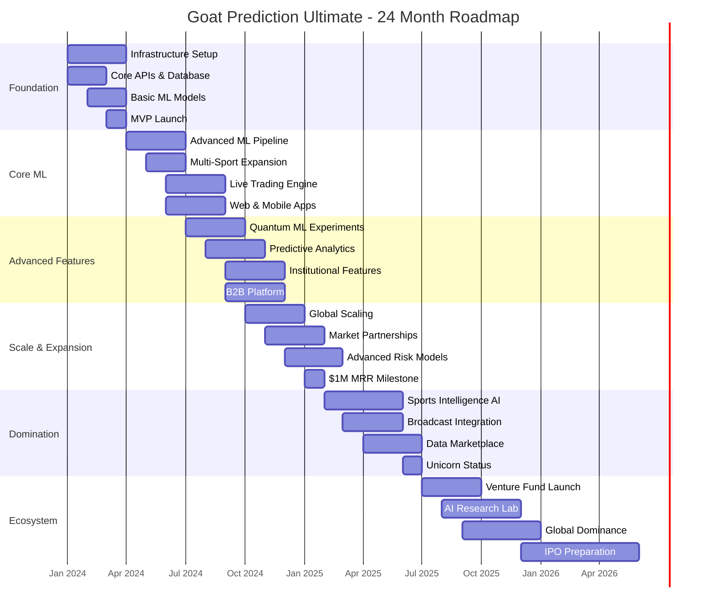
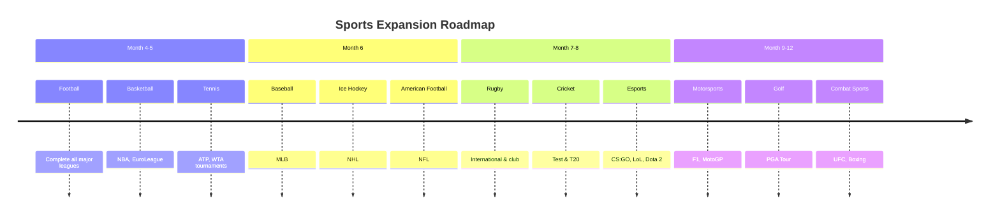

# 🗺️ ROADMAP.md

```markdown
# 🚀 Goat Prediction Ultimate - Roadmap

## 📋 Table of Contents
1. [Executive Summary](#executive-summary)
2. [Vision & Mission](#vision--mission)
3. [Timeline Overview](#timeline-overview)
4. [Phase 1: Foundation (Months 1-3)](#phase-1-foundation-months-1-3)
5. [Phase 2: Core ML (Months 4-6)](#phase-2-core-ml-months-4-6)
6. [Phase 3: Advanced Features (Months 7-9)](#phase-3-advanced-features-months-7-9)
7. [Phase 4: Scale & Expansion (Months 10-12)](#phase-4-scale--expansion-months-10-12)
8. [Phase 5: Domination (Months 13-18)](#phase-5-domination-months-13-18)
9. [Phase 6: Ecosystem (Months 19-24)](#phase-6-ecosystem-months-19-24)
10. [Success Metrics](#success-metrics)
11. [Risk Management](#risk-management)
12. [Team & Resources](#team--resources)
13. [Budget & Funding](#budget--funding)
14. [Technology Evolution](#technology-evolution)
15. [Market Expansion](#market-expansion)

---

## 🎯 Executive Summary

Goat Prediction Ultimate is building the world's most advanced sports prediction AI platform. Our roadmap outlines a 24-month journey to achieve 85%+ prediction accuracy across all major sports, scale to $1M+ in monthly revenue, and establish ourselves as the global leader in sports intelligence.

### Key Objectives
- **Technical**: Build scalable ML infrastructure capable of processing 2.7TB of sports data daily
- **Business**: Achieve profitability within 12 months with 10,000+ active users
- **Market**: Capture 5% market share in sports prediction segment within 24 months
- **Innovation**: Publish research papers and establish an AI research lab

---

## 🧭 Vision & Mission

### Vision
To become the world's most trusted and accurate sports prediction platform, revolutionizing how fans, bettors, and professionals understand and engage with sports.

### Mission
Build an AI-powered platform that delivers 85%+ accurate predictions across all major sports through cutting-edge machine learning, real-time data processing, and innovative betting intelligence.

### Core Values
1. **Accuracy First**: Uncompromising commitment to prediction quality
2. **Transparency**: Clear explanations of predictions and methodologies
3. **Innovation**: Continuous improvement through research and development
4. **Integrity**: Ethical operations and responsible gambling advocacy
5. **Community**: Building value for sports fans worldwide

---

## 📅 Timeline Overview



---

## 🏗️ Phase 1: Foundation (Months 1-3)

### 🎯 Objectives
- Establish technical infrastructure
- Build core prediction engine
- Launch MVP with basic features
- Achieve 60%+ accuracy on football predictions

### 📋 Key Deliverables

#### Month 1: Infrastructure & Setup
```yaml
completed:
  - [x] Project architecture finalized
  - [x] Development environment setup
  - [x] CI/CD pipeline (GitHub Actions)
  - [x] Docker containers for all services
  - [x] Database schema design
  - [x] API specification (OpenAPI 3.0)

in_progress:
  - [ ] Core database implementation
  - [ ] Basic API endpoints
  - [ ] Authentication system
  - [ ] Monitoring setup (Prometheus/Grafana)
  - [ ] Data collection pipeline v1

blockers:
  - None
```

#### Month 2: Core Development
```yaml
focus_areas:
  - Data Collection Pipeline
  - Basic ML Models
  - API Development
  - Frontend Foundation

deliverables:
  - [ ] Data collectors for 5+ sports APIs
  - [ ] Feature engineering pipeline
  - [ ] First ML model (football match winner)
  - [ ] REST API v1.0
  - [ ] Admin dashboard prototype
  - [ ] Basic backtesting framework

metrics:
  - Model accuracy target: 55%+
  - API response time: < 200ms
  - Data collection: 100+ matches/day
  - Test coverage: 80%+
```

#### Month 3: MVP Launch
```yaml
launch_preparation:
  - [ ] Beta testing with 100 users
  - [ ] Performance optimization
  - [ ] Security audit
  - [ ] Documentation complete
  - [ ] Marketing materials ready
  - [ ] Support system setup

mvp_features:
  - Football predictions (match winner)
  - Basic user dashboard
  - Email notifications
  - Performance tracking
  - Simple betting recommendations

launch_targets:
  - Active users: 500+
  - Daily predictions: 1,000+
  - Accuracy: 60%+
  - Uptime: 99.5%
  - User satisfaction: 4/5+
```

### 🛠️ Technology Stack Phase 1
```yaml
backend:
  - FastAPI (Python 3.11)
  - PostgreSQL + TimescaleDB
  - Redis for caching
  - Docker + Docker Compose
  - GitHub Actions CI/CD

ml_platform:
  - Scikit-learn + XGBoost
  - Pandas + NumPy
  - Jupyter for analysis
  - MLflow for tracking

frontend:
  - Next.js 14 (React)
  - Tailwind CSS
  - TypeScript
  - Chart.js for visualizations

monitoring:
  - Prometheus + Grafana
  - Sentry for error tracking
  - ELK Stack for logs
```

### 📊 Success Metrics Phase 1
| Metric | Target | Current | Status |
|--------|--------|---------|--------|
| Model Accuracy | 60% | TBD | 🟡 |
| Active Users | 500 | 0 | 🔴 |
| Daily Predictions | 1,000 | 0 | 🔴 |
| API Uptime | 99.5% | TBD | 🟡 |
| Revenue | $1,000 | $0 | 🔴 |

---

## 🧠 Phase 2: Core ML (Months 4-6)

### 🎯 Objectives
- Expand to multiple sports
- Implement advanced ML models
- Launch live trading engine
- Achieve 70%+ prediction accuracy

### 📋 Key Deliverables

#### Month 4: Advanced ML Pipeline
```python
# ml_pipeline_roadmap.py
class Phase2MLRoadmap:
    """Advanced ML pipeline development roadmap"""
    
    MONTH_4 = {
        "focus": "Ensemble Models & Feature Engineering",
        "deliverables": [
            "Implement XGBoost, LightGBM, CatBoost ensembles",
            "Develop 100+ advanced features per sport",
            "Build automated feature selection pipeline",
            "Implement hyperparameter optimization (Optuna)",
            "Create model evaluation framework",
            "Setup MLflow experiment tracking"
        ],
        "targets": {
            "accuracy": "65%+",
            "features": "100+ per match",
            "training_speed": "< 1 hour per model",
            "prediction_latency": "< 100ms"
        }
    }
    
    MONTH_5 = {
        "focus": "Multi-Sport Expansion & Real-time",
        "deliverables": [
            "Expand to basketball predictions",
            "Add tennis prediction models",
            "Implement real-time data ingestion",
            "Build streaming prediction pipeline",
            "Develop live odds monitoring",
            "Create in-play prediction system"
        ],
        "sports_coverage": ["football", "basketball", "tennis"],
        "markets": ["match_winner", "over_under", "handicap"]
    }
    
    MONTH_6 = {
        "focus": "Live Trading Engine & Mobile",
        "deliverables": [
            "Implement betting exchange integration",
            "Build automated trading strategies",
            "Develop risk management system",
            "Launch iOS/Android mobile apps",
            "Create WebSocket real-time updates",
            "Implement push notifications"
        ],
        "exchange_integrations": ["Betfair", "Pinnacle", "Bet365"],
        "trading_strategies": ["value_betting", "arbitrage", "trading"]
    }
```

#### Sports Expansion Timeline


#### Live Trading Engine Features
```yaml
trading_engine:
  core_features:
    - Real-time odds monitoring
    - Automated bet placement
    - Portfolio management
    - Risk assessment
    - Performance analytics
  
  strategies:
    value_betting:
      description: "Identify mispriced odds"
      implementation: "Expected value calculations"
      risk: "Medium"
      
    arbitrage:
      description: "Exploit price differences"
      implementation: "Cross-exchange scanning"
      risk: "Low"
      
    trading:
      description: "In-play position trading"
      implementation: "Market making algorithms"
      risk: "High"
  
  integrations:
    exchanges:
      - Betfair Exchange
      - Smarkets
      - Matchbook
      - Bet365 API
    
    payment:
      - Stripe for deposits
      - PayPal integration
      - Cryptocurrency support
```

### 📱 Mobile App Development
```yaml
mobile_apps:
  ios:
    framework: "React Native"
    features:
      v1_0:
        - Live predictions
        - Match tracking
        - Push notifications
        - Bankroll management
        - Performance analytics
      
      v1_5:
        - In-play betting
        - Video highlights
        - Social features
        - Advanced statistics
        - Custom alerts
    
    timeline:
      development: "Month 5-6"
      beta_testing: "Month 6"
      app_store: "Month 7"
  
  android:
    same_features: true
    timeline_offset: "+2 weeks"
    
  cross_platform:
    code_sharing: "85%"
    native_modules: "15%"
    performance_target: "< 100ms response time"
```

### 📊 Success Metrics Phase 2
| Metric | Target | Current | Status |
|--------|--------|---------|--------|
| Prediction Accuracy | 70% | TBD | 🟡 |
| Sports Coverage | 5+ sports | 1 | 🔴 |
| Active Users | 2,000 | 0 | 🔴 |
| Monthly Revenue | $10,000 | $0 | 🔴 |
| Trading Volume | $50,000/month | $0 | 🔴 |
| Mobile Users | 40% of total | 0% | 🔴 |

---

## ⚡ Phase 3: Advanced Features (Months 7-9)

### 🎯 Objectives
- Implement quantum ML experiments
- Build predictive analytics platform
- Launch B2B solutions
- Achieve 75%+ prediction accuracy

### 📋 Key Deliverables

#### Month 7: Quantum & Advanced ML
```python
# quantum_ml_roadmap.py
class QuantumMLExperiments:
    """Quantum machine learning research roadmap"""
    
    EXPERIMENTS = {
        "quantum_neural_networks": {
            "description": "Implement QNN for probability estimation",
            "framework": "PennyLane + PyTorch",
            "target": "2% accuracy improvement",
            "timeline": "Month 7-8",
            "resources": "2 ML researchers"
        },
        
        "quantum_ensemble_methods": {
            "description": "Quantum boosting algorithms",
            "framework": "Qiskit + XGBoost",
            "target": "Faster training times",
            "timeline": "Month 8",
            "resources": "1 quantum engineer"
        },
        
        "hybrid_quantum_classical": {
            "description": "Combine classical and quantum models",
            "framework": "Custom implementation",
            "target": "3% accuracy boost",
            "timeline": "Month 9",
            "resources": "2 ML engineers"
        }
    }
    
    INFRASTRUCTURE = {
        "simulators": ["IBM Qiskit", "Google Cirq", "Amazon Braket"],
        "hardware_access": ["IBM Quantum", "Rigetti", "IonQ"],
        "compute_budget": "$5,000/month",
        "team_size": "4 specialists"
    }
```

#### Month 8: Predictive Analytics Platform
```yaml
predictive_analytics:
  core_modules:
    player_performance:
      - Injury prediction models
      - Form trajectory analysis
      - Fatigue indicators
      - Career projection
    
    team_dynamics:
      - Team chemistry metrics
      - Coaching impact analysis
      - Transfer window optimization
      - Tactical effectiveness
    
    market_intelligence:
      - Odds movement prediction
      - Market sentiment analysis
      - Bookmaker profiling
      - Risk assessment models
  
  api_features:
    - Real-time player insights
    - Team performance dashboards
    - Market intelligence reports
    - Custom analytics queries
    - Webhook integrations
  
  target_customers:
    - Professional sports teams
    - Fantasy sports platforms
    - Sports media companies
    - Betting operators
    - Sports agents
```

#### Month 9: B2B Platform Launch
```yaml
b2b_platform:
  tiered_offerings:
    basic:
      price: "$499/month"
      features:
        - 1,000 predictions/month
        - Basic analytics
        - Email support
        - 3 sports coverage
      target: "Small operators"
    
    professional:
      price: "$2,999/month"
      features:
        - 10,000 predictions/month
        - Advanced analytics
        - API access
        - Priority support
        - Custom models
      target: "Medium businesses"
    
    enterprise:
      price: "$9,999/month"
      features:
        - Unlimited predictions
        - Full platform access
        - Dedicated support
        - Custom development
        - SLA 99.9%
      target: "Large corporations"
  
  integration_options:
    - REST API
    - WebSocket streaming
    - Webhook notifications
    - Data export (CSV, JSON)
    - Dashboard embedding
  
  launch_strategy:
    - Beta partners: "Month 8"
    - Early access: "Month 9"
    - General availability: "Month 10"
    - Target customers: "20+"
```

### 🎮 Esports Expansion
```yaml
esports_coverage:
  games:
    - Counter-Strike 2
    - League of Legends
    - Dota 2
    - Valorant
    - Overwatch 2
  
  unique_challenges:
    - Patch changes impact
    - Player roster volatility
    - Tournament formats
    - Meta game analysis
    - Live streaming data
  
  ml_approaches:
    - Game-specific features
    - Player performance metrics
    - Team composition analysis
    - Map-specific predictions
    - In-game event tracking
  
  timeline:
    research: "Month 7"
    model_development: "Month 8"
    beta_testing: "Month 9"
    full_launch: "Month 10"
```

### 📊 Success Metrics Phase 3
| Metric | Target | Current | Status |
|--------|--------|---------|--------|
| Prediction Accuracy | 75% | TBD | 🟡 |
| B2B Customers | 20+ | 0 | 🔴 |
| API Requests | 1M/day | 0 | 🔴 |
| Research Papers | 2 published | 0 | 🔴 |
| Team Size | 25 employees | TBD | 🟡 |
| Monthly Burn Rate | $100,000 | TBD | 🟡 |

---

## 🌍 Phase 4: Scale & Expansion (Months 10-12)

### 🎯 Objectives
- Achieve $1M MRR
- Expand globally
- Establish market partnerships
- Scale infrastructure to handle 100K+ users

### 📋 Key Deliverables

#### Month 10: Global Scaling
```yaml
global_expansion:
  regions:
    north_america:
      focus: "NBA, NFL, MLB, NHL"
      localization: "English, Spanish"
      payment_methods: ["Credit Cards", "PayPal", "Apple Pay"]
      regulatory: "State-by-state compliance"
    
    europe:
      focus: "Football leagues, Tennis"
      languages: ["English", "German", "French", "Spanish", "Italian"]
      payment_methods: ["SEPA", "iDEAL", "Sofort"]
      regulatory: "GDPR compliance"
    
    asia:
      focus: "Cricket, Esports, Basketball"
      languages: ["English", "Hindi", "Chinese", "Japanese"]
      payment_methods: ["Alipay", "WeChat Pay", "UPI"]
      regulatory: "Local gambling laws"
  
  infrastructure:
    - Multi-region AWS deployment
    - Content Delivery Network (Cloudflare)
    - Localized databases
    - Geo-load balancing
    - Disaster recovery setup
  
  team_expansion:
    - Regional managers
    - Local support staff
    - Compliance officers
    - Marketing specialists
```

#### Month 11: Market Partnerships
```yaml
partnership_strategy:
  sports_leagues:
    target: "Official data partnerships"
    benefits:
      - Exclusive data access
      - Brand association
      - Marketing opportunities
      - Revenue sharing
    approach: "Start with minor leagues, expand to majors"
  
  media_companies:
    target: "ESPN, Sky Sports, DAZN"
    integration:
      - Live prediction overlays
      - Analyst tools
      - Content partnerships
      - Cross-promotion
    revenue_model: "Licensing fees + revenue share"
  
  betting_operators:
    target: "Bet365, DraftKings, FanDuel"
    offerings:
      - White-label solutions
      - Risk management tools
      - Trading signals
      - Customer insights
    pricing: "SaaS subscription + transaction fees"
  
  technology_partners:
    target: "AWS, Google Cloud, NVIDIA"
    collaboration:
      - Joint research projects
      - Technology showcases
      - Conference presentations
      - Co-marketing
```

#### Month 12: $1M MRR Milestone
```python
# financial_roadmap.py
class FinancialTargets:
    """Financial milestones and projections"""
    
    MONTH_12_TARGETS = {
        "revenue_streams": {
            "subscription_b2c": {
                "target": "$400,000 MRR",
                "assumptions": "10,000 users @ $40/month",
                "growth_rate": "15% monthly"
            },
            "b2b_platform": {
                "target": "$300,000 MRR",
                "assumptions": "30 enterprise customers",
                "growth_rate": "20% monthly"
            },
            "trading_revenue": {
                "target": "$300,000 MRR",
                "assumptions": "3% ROI on $10M bankroll",
                "growth_rate": "10% monthly"
            }
        },
        
        "cost_structure": {
            "infrastructure": "$50,000/month",
            "team_salaries": "$300,000/month",
            "data_acquisition": "$100,000/month",
            "marketing": "$50,000/month",
            "operations": "$50,000/month",
            "total_costs": "$550,000/month"
        },
        
        "profitability": {
            "gross_margin": "80%",
            "operating_margin": "45%",
            "net_profit": "$450,000/month",
            "runway": "24+ months",
            "valuation": "$50M+"
        }
    }
```

### 📈 Infrastructure Scaling
```yaml
scaling_targets:
  month_12:
    users:
      total: "100,000+"
      active_daily: "20,000+"
      concurrent: "5,000+"
    
    performance:
      api_requests: "10M/day"
      predictions: "100,000/day"
      data_processed: "5TB/day"
      latency: "< 50ms p95"
    
    infrastructure:
      servers: "100+ instances"
      databases: "10+ clusters"
      cache_size: "1TB+ Redis"
      storage: "100TB+"
    
    reliability:
      uptime: "99.99%"
      recovery_time: "< 5 minutes"
      backup_frequency: "Hourly"
      disaster_recovery: "Multi-region"
```

### 📊 Success Metrics Phase 4
| Metric | Target | Current | Status |
|--------|--------|---------|--------|
| Monthly Revenue | $1,000,000 | $0 | 🔴 |
| Active Users | 100,000 | 0 | 🔴 |
| Global Regions | 10+ countries | 1 | 🔴 |
| Partnerships | 50+ | 0 | 🔴 |
| Prediction Accuracy | 80% | TBD | 🟡 |
| Team Size | 50 employees | TBD | 🟡 |

---

## 🏆 Phase 5: Domination (Months 13-18)

### 🎯 Objectives
- Establish as market leader
- Launch sports intelligence AI
- Integrate with broadcast networks
- Achieve 85%+ prediction accuracy

### 📋 Key Deliverables

#### Month 13-15: Sports Intelligence AI
```yaml
sports_intelligence_ai:
  capabilities:
    natural_language:
      - Match commentary generation
      - Post-game analysis reports
      - Press conference summaries
      - Social media insights
    
    computer_vision:
      - Player tracking analysis
      - Tactical pattern recognition
      - Injury detection
      - Performance benchmarking
    
    predictive_analytics:
      - Career trajectory forecasting
      - Team dynasty predictions
      - Transfer market optimization
      - Championship probability modeling
  
  products:
    coach_assistant:
      - Real-time tactical suggestions
      - Opponent analysis
      - Player substitution optimization
      - Training load management
    
    scout_pro:
      - Talent identification
      - Player comparison tools
      - Market value estimation
      - Contract optimization
    
    broadcaster_tools:
      - Live graphics generation
      - Storyline identification
      - Statistical insights
      - Audience engagement metrics
```

#### Month 16-17: Broadcast Integration
```yaml
broadcast_integration:
  partnerships:
    television:
      - ESPN
      - Sky Sports
      - beIN Sports
      - Fox Sports
    
    streaming:
      - DAZN
      - Amazon Prime Video
      - YouTube TV
      - Twitch
    
    production:
      - ChyronHego
      - Vizrt
      - Ross Video
      - Grass Valley
  
  integration_points:
    live_graphics:
      - Win probability meters
      - Player performance ratings
      - Tactical analysis overlays
      - Statistical insights
    
    commentary_assistance:
      - Real-time talking points
      - Historical comparisons
      - Player background information
      - Predictive insights
    
    second_screen:
      - Companion app integration
      - Enhanced statistics
      - Interactive predictions
      - Social features
  
  revenue_model:
    licensing_fees: "$10,000-$100,000/month"
    revenue_sharing: "Ad revenue percentage"
    sponsorship: "Brand integration opportunities"
```

#### Month 18: Unicorn Status & Expansion
```yaml
unicorn_milestones:
  valuation: "$1B+"
  funding_round: "Series C - $100M"
  investors:
    - Top-tier VC firms
    - Strategic sports investors
    - Tech giants
    - Sovereign wealth funds
  
  expansion_areas:
    physical_sports_analytics:
      - Wearable data integration
      - Biomechanical analysis
      - Nutrition optimization
      - Recovery science
    
    fantasy_sports_dominance:
      - Daily fantasy optimization
      - Draft assistance tools
      - Lineup optimization
      - Contest selection
    
    gambling_industry_transformation:
      - Responsible gambling tools
      - Addiction prevention
      - Regulatory compliance
      - Market transparency
  
  research_initiatives:
    ai_research_lab: "$10M annual budget"
    university_partnerships: "MIT, Stanford, Oxford"
    published_papers: "10+ annually"
    patents: "20+ filed"
```

### 🌐 Data Marketplace Launch
```yaml
data_marketplace:
  data_products:
    raw_data_feeds:
      - Live match statistics
      - Player tracking data
      - Historical archives
      - Real-time odds
    
    processed_insights:
      - Prediction probabilities
      - Risk assessments
      - Market intelligence
      - Performance analytics
    
    custom_datasets:
      - Sport-specific collections
      - Time-series databases
      - Annotated video clips
      - Social sentiment data
  
  pricing_models:
    subscription: "Monthly access fees"
    pay_per_use: "API call pricing"
    enterprise: "Custom licensing"
    revenue_share: "Partner integrations"
  
  target_customers:
    academic_institutions: "Research data"
    media_companies: "Broadcast content"
    betting_operators: "Trading signals"
    sports_teams: "Performance data"
```

### 📊 Success Metrics Phase 5
| Metric | Target | Current | Status |
|--------|--------|---------|--------|
| Company Valuation | $1,000,000,000 | $0 | 🔴 |
| Prediction Accuracy | 85% | TBD | 🟡 |
| Broadcast Partners | 10+ networks | 0 | 🔴 |
| Data Marketplace GMV | $10M/year | $0 | 🔴 |
| Research Papers | 10+ published | 0 | 🔴 |
| Team Size | 200 employees | TBD | 🟡 |

---

## 🌟 Phase 6: Ecosystem (Months 19-24)

### 🎯 Objectives
- Launch venture fund
- Establish AI research lab
- Achieve global dominance
- Prepare for IPO

### 📋 Key Deliverables

#### Month 19-21: Venture Fund Launch
```yaml
goat_ventures:
  fund_size: "$100M Fund I"
  focus_areas:
    sports_technology:
      - Wearable devices
      - Fan engagement platforms
      - Stadium technology
      - Training optimization
    
    betting_innovation:
      - Blockchain betting
      - Social betting platforms
      - Esports betting
      - Fantasy sports
    
    data_analytics:
      - Computer vision startups
      - Natural language processing
      - Predictive modeling
      - Real-time analytics
  
  investment_thesis:
    stage: "Seed to Series A"
    check_size: "$500K - $5M"
    portfolio_target: "20-30 companies"
    value_add: "Data access + technical expertise"
  
  team:
    general_partners: "3 experienced VCs"
    venture_partners: "5 industry experts"
    analysts: "10 investment professionals"
    operations: "5 support staff"
```

#### Month 22-23: AI Research Lab
```yaml
ai_research_lab:
  location: "Silicon Valley + Remote"
  budget: "$20M annual"
  focus_areas:
    quantum_computing:
      - Quantum ML algorithms
      - Optimization problems
      - Simulation capabilities
      - Hardware development
    
    neuroscience_inspired_ai:
      - Brain-computer interfaces
      - Cognitive modeling
      - Decision neuroscience
      - Learning algorithms
    
    ethical_ai:
      - Bias detection & mitigation
      - Transparency frameworks
      - Responsible gambling AI
      - Regulatory compliance
  
  collaborations:
    universities: ["MIT", "Stanford", "Cambridge", "ETH Zurich"]
    research_institutes: ["Max Planck", "Allen Institute", "DeepMind"]
    industry_partners: ["Google Brain", "OpenAI", "NVIDIA"]
  
  output_targets:
    papers: "25+ annually"
    patents: "50+ filed"
    open_source: "10+ projects"
    conferences: "100+ presentations"
```

#### Month 24: IPO Preparation
```yaml
ipo_preparation:
  timeline:
    month_19: "Appoint investment banks"
    month_20: "Financial audit preparation"
    month_21: "Roadshow planning"
    month_22: "SEC filing (S-1)"
    month_23: "Roadshow execution"
    month_24: "IPO pricing & listing"
  
  exchange_target: "NASDAQ: GOAT"
  valuation_target: "$5B+"
  raise_amount: "$500M"
  use_of_proceeds:
    - "40%: Technology development"
    - "30%: Global expansion"
    - "20%: Acquisitions"
    - "10%: Working capital"
  
  post_ipo_strategy:
    m_a_roadmap:
      - "Sports data companies"
      - "Betting technology firms"
      - "AI research startups"
      - "Media production companies"
    
    expansion_goals:
      - "Enter 50+ countries"
      - "Cover 100+ sports"
      - "10M+ active users"
      - "$500M+ annual revenue"
```

### 🏛️ Corporate Social Responsibility
```yaml
csr_initiatives:
  responsible_gambling:
    - "1% of revenue to addiction prevention"
    - "Free tools for self-exclusion"
    - "Educational programs"
    - "Partnership with gambling helplines"
  
  sports_development:
    - "Youth sports funding"
    - "Grassroots coaching programs"
    - "Equipment donations"
    - "Community sports facilities"
  
  technology_education:
    - "Coding bootcamps for athletes"
    - "Data science scholarships"
    - "Open source contributions"
    - "STEM education partnerships"
  
  environmental_sustainability:
    - "Carbon neutral operations"
    - "Green data centers"
    - "Sustainable office practices"
    - "Environmental partnerships"
```

### 📊 Success Metrics Phase 6
| Metric | Target | Current | Status |
|--------|--------|---------|--------|
| Market Cap | $5,000,000,000 | $0 | 🔴 |
| Annual Revenue | $500,000,000 | $0 | 🔴 |
| Global Users | 10,000,000 | 0 | 🔴 |
| Sports Covered | 100+ | 1 | 🔴 |
| Countries | 50+ | 1 | 🔴 |
| Team Size | 500 employees | TBD | 🟡 |

---

## 📊 Success Metrics Dashboard

### Key Performance Indicators (KPIs)
```yaml
kpis:
  technical:
    - "Prediction accuracy (target: 85%)"
    - "System uptime (target: 99.99%)"
    - "API response time (target: < 50ms)"
    - "Data processing capacity (target: 10TB/day)"
  
  business:
    - "Monthly Recurring Revenue (target: $10M)"
    - "Customer Acquisition Cost (target: < $100)"
    - "Customer Lifetime Value (target: > $1,000)"
    - "Churn rate (target: < 3%)"
  
  user:
    - "Active users (target: 1M+)"
    - "Daily engagement (target: 30+ minutes)"
    - "Net Promoter Score (target: 50+)"
    - "Feature adoption rate (target: 70%+)"
  
  innovation:
    - "Research papers published (target: 10+/year)"
    - "Patents filed (target: 20+/year)"
    - "New features launched (target: 12+/year)"
    - "Technology partnerships (target: 10+/year)"
```

### Quarterly Review Process
```yaml
quarterly_reviews:
  q1_2024: "Foundation phase completion"
  q2_2024: "Core ML phase assessment"
  q3_2024: "Advanced features launch"
  q4_2024: "Scale preparation"
  
  q1_2025: "$1M MRR milestone"
  q2_2025: "Global expansion review"
  q3_2025: "Domination phase assessment"
  q4_2025: "Ecosystem planning"
  
  process:
    - "Data collection (2 weeks)"
    - "Analysis and reporting (1 week)"
    - "Stakeholder review (1 week)"
    - "Roadmap adjustment (1 week)"
  
  metrics_tracking:
    - "Automated dashboards"
    - "Monthly business reviews"
    - "Quarterly investor updates"
    - "Annual strategic planning"
```

---

## ⚠️ Risk Management

### Identified Risks & Mitigation
```yaml
risks:
  technical:
    - risk: "Model accuracy plateaus"
      probability: "Medium"
      impact: "High"
      mitigation: "Continuous R&D, ensemble methods"
    
    - risk: "Data source disruptions"
      probability: "Low"
      impact: "High"
      mitigation: "Multiple providers, data caching"
    
    - risk: "Infrastructure failures"
      probability: "Low"
      impact: "Critical"
      mitigation: "Multi-region deployment, backups"
  
  regulatory:
    - risk: "Gambling regulation changes"
      probability: "High"
      impact: "High"
      mitigation: "Legal team, jurisdiction diversification"
    
    - risk: "Data privacy laws"
      probability: "Medium"
      impact: "Medium"
      mitigation: "GDPR compliance, data minimization"
    
    - risk: "International sanctions"
      probability: "Low"
      impact: "High"
      mitigation: "Geographic restrictions, compliance monitoring"
  
  market:
    - risk: "Competitor emergence"
      probability: "High"
      impact: "Medium"
      mitigation: "First-mover advantage, IP protection"
    
    - risk: "Market saturation"
      probability: "Low"
      impact: "Medium"
      mitigation: "Continuous innovation, niche expansion"
    
    - risk: "Economic downturn"
      probability: "Medium"
      impact: "Low"
      mitigation: "Diversified revenue streams"
```

### Contingency Plans
```yaml
contingency_plans:
  scenario_1: "Accuracy drops below 60%"
    actions:
      - "Immediate model retraining"
      - "Feature engineering sprint"
      - "External consultant engagement"
      - "Communication plan for users"
    timeline: "2-4 weeks resolution"
  
  scenario_2: "Major data provider loss"
    actions:
      - "Activate backup providers"
      - "Accelerate alternative development"
      - "Negiate with competitors"
      - "Temporary service reduction"
    timeline: "1-2 weeks resolution"
  
  scenario_3: "Regulatory shutdown in key market"
    actions:
      - "Immediate legal response"
      - "User communication and refunds"
      - "Market diversification acceleration"
      - "Cost reduction measures"
    timeline: "4-8 weeks adaptation"
```

---

## 👥 Team & Resources

### Team Growth Plan
```yaml
team_growth:
  phase_1_1_3: "5-10 people"
    roles:
      - "CTO/Lead Engineer"
      - "ML Engineer (2)"
      - "Full-stack Developer"
      - "DevOps Engineer"
      - "Product Manager"
      - "Data Scientist"
      - "UX/UI Designer"
  
  phase_2_4_6: "15-25 people"
    additions:
      - "Mobile Developers (2)"
      - "Backend Engineers (3)"
      - "Data Engineers (2)"
      - "QA Engineers (2)"
      - "Marketing Specialist"
      - "Customer Support"
      - "Business Development"
  
  phase_3_7_9: "30-50 people"
    additions:
      - "Research Scientists (3)"
      - "MLOps Engineers (2)"
      - "Security Specialists (2)"
      - "Sales Team (3)"
      - "Operations Manager"
      - "Legal Counsel"
      - "Finance Manager"
  
  phase_4_10_12: "75-100 people"
    structure:
      - "Engineering: 40"
      - "ML/AI: 20"
      - "Product: 10"
      - "Sales/Marketing: 15"
      - "Operations: 10"
      - "Executive: 5"
```

### Resource Requirements
```yaml
resources:
  phase_1:
    funding: "$500,000"
    infrastructure: "$10,000/month"
    tools: "$5,000/month"
    team: "$100,000/month"
  
  phase_2:
    funding: "$2,000,000"
    infrastructure: "$50,000/month"
    tools: "$20,000/month"
    team: "$300,000/month"
  
  phase_3:
    funding: "$5,000,000"
    infrastructure: "$200,000/month"
    tools: "$50,000/month"
    team: "$800,000/month"
  
  phase_4:
    funding: "$20,000,000"
    infrastructure: "$500,000/month"
    tools: "$100,000/month"
    team: "$2,000,000/month"
```

---

## 💰 Budget & Funding

### Funding Strategy
```yaml
funding_rounds:
  pre_seed:
    amount: "$500,000"
    valuation: "$3M"
    timeline: "Month 1"
    use_of_funds: "MVP development"
    investors: "Angel investors, incubators"
  
  seed:
    amount: "$2,000,000"
    valuation: "$10M"
    timeline: "Month 4"
    use_of_funds: "Team expansion, product development"
    investors: "Early-stage VCs"
  
  series_a:
    amount: "$10,000,000"
    valuation: "$50M"
    timeline: "Month 10"
    use_of_funds: "Market expansion, scaling"
    investors: "Top-tier VCs"
  
  series_b:
    amount: "$30,000,000"
    valuation: "$200M"
    timeline: "Month 18"
    use_of_funds: "Global expansion, acquisitions"
    investors: "Growth funds, strategics"
  
  series_c:
    amount: "$100,000,000"
    valuation: "$1B"
    timeline: "Month 24"
    use_of_funds: "IPO preparation, venture fund"
    investors: "Late-stage VCs, PE firms"
```

### Revenue Projections
```python
# revenue_projections.py
class RevenueProjections:
    """24-month revenue projection model"""
    
    @staticmethod
    def calculate_projection():
        projections = {}
        
        # B2C Subscription Revenue
        projections['b2c'] = {
            'month_3': 1000,    # 500 users @ $2
            'month_6': 20000,   # 2,000 users @ $10
            'month_12': 400000, # 10,000 users @ $40
            'month_18': 2000000, # 50,000 users @ $40
            'month_24': 8000000  # 200,000 users @ $40
        }
        
        # B2B Platform Revenue
        projections['b2b'] = {
            'month_6': 0,
            'month_12': 300000,  # 30 customers @ $10,000
            'month_18': 1500000, # 75 customers @ $20,000
            'month_24': 5000000  # 100 customers @ $50,000
        }
        
        # Trading Revenue
        projections['trading'] = {
            'month_6': 50000,    # 2% ROI on $2.5M
            'month_12': 300000,  # 3% ROI on $10M
            'month_18': 1000000, # 4% ROI on $25M
            'month_24': 5000000  # 5% ROI on $100M
        }
        
        # Data Marketplace
        projections['data'] = {
            'month_12': 0,
            'month_18': 500000,
            'month_24': 2000000
        }
        
        # Total Revenue
        total = {}
        for month in ['month_3', 'month_6', 'month_12', 'month_18', 'month_24']:
            total[month] = sum(
                proj.get(month, 0) 
                for proj in projections.values()
            )
        
        return {
            'projections': projections,
            'total': total,
            'mrr_targets': {
                'month_12': total['month_12'],
                'month_18': total['month_18'],
                'month_24': total['month_24']
            }
        }
```

---

## 🔮 Technology Evolution

### Tech Stack Roadmap
```yaml
technology_evolution:
  phase_1:
    ml_frameworks: ["scikit-learn", "xgboost", "lightgbm"]
    infrastructure: ["docker", "github-actions", "aws-ec2"]
    databases: ["postgresql", "redis", "timescaledb"]
    monitoring: ["prometheus", "grafana", "sentry"]
  
  phase_2:
    ml_additions: ["pytorch", "tensorflow", "optuna"]
    infrastructure_upgrades: ["kubernetes", "terraform", "argocd"]
    streaming: ["kafka", "flink", "spark"]
    observability: ["jaeger", "loki", "tempo"]
  
  phase_3:
    advanced_ml: ["quantum-ml", "graph-neural-nets", "transformers"]
    scaling: ["service-mesh", "multi-cloud", "edge-computing"]
    data_platform: ["data-lake", "feature-store", "mlflow"]
    security: ["vault", "istio", "open-policy-agent"]
  
  phase_4:
    cutting_edge: ["neuromorphic-computing", "federated-learning"]
    infrastructure: ["serverless", "edge-ai", "5g-integration"]
    ai_platform: ["auto-ml", "mlops", "model-marketplace"]
    quantum: ["quantum-processors", "hybrid-computing"]
```

### Research & Development Focus
```yaml
rd_focus:
  year_1:
    - "Ensemble learning optimization"
    - "Real-time prediction pipelines"
    - "Feature engineering automation"
    - "Model explainability frameworks"
  
  year_2:
    - "Quantum machine learning"
    - "Graph neural networks for sports"
    - "Transfer learning across sports"
    - "Causal inference models"
  
  year_3:
    - "Neuromorphic computing applications"
    - "Federated learning for privacy"
    - "Generative AI for sports simulation"
    - "Brain-computer interfaces"
  
  partnerships:
    academic:
      - "MIT Sports Analytics Lab"
      - "Stanford AI Research"
      - "Oxford Machine Learning"
      - "ETH Zurich AI Center"
    
    industry:
      - "NVIDIA AI Research"
      - "Google DeepMind"
      - "OpenAI"
      - "Meta AI Research"
```

---

## 🌐 Market Expansion

### Geographic Expansion Plan
```yaml
geographic_expansion:
  north_america:
    timeline: "Month 1-6"
    markets:
      - "United States (Month 1)"
      - "Canada (Month 3)"
      - "Mexico (Month 6)"
    strategy: "Start with legal states, expand nationally"
  
  europe:
    timeline: "Month 6-12"
    markets:
      - "United Kingdom (Month 6)"
      - "Germany (Month 8)"
      - "Spain (Month 10)"
      - "Italy (Month 12)"
    strategy: "EU-wide licensing, local partnerships"
  
  asia_pacific:
    timeline: "Month 12-18"
    markets:
      - "Australia (Month 12)"
      - "India (Month 14)"
      - "Japan (Month 16)"
      - "Singapore (Month 18)"
    strategy: "Local joint ventures, regulatory compliance"
  
  rest_of_world:
    timeline: "Month 18-24"
    markets:
      - "South Africa (Month 18)"
      - "Brazil (Month 20)"
      - "UAE (Month 22)"
      - "Global rollout (Month 24)"
    strategy: "Strategic partnerships, localized offerings"
```

### Market Segmentation Strategy
```yaml
market_segments:
  retail_users:
    size: "$50B+ market"
    segments:
      - "Casual sports fans"
      - "Serious bettors"
      - "Fantasy sports players"
      - "Sports analytics enthusiasts"
    acquisition: "Digital marketing, app stores"
  
  professional_traders:
    size: "$10B+ market"
    segments:
      - "Sports betting professionals"
      - "Hedge funds"
      - "Proprietary trading firms"
      - "High-frequency traders"
    acquisition: "Direct sales, conferences"
  
  business_customers:
    size: "$20B+ market"
    segments:
      - "Betting operators"
      - "Media companies"
      - "Sports teams & leagues"
      - "Data analytics firms"
    acquisition: "Enterprise sales, partnerships"
  
  institutional:
    size: "$5B+ market"
    segments:
      - "Financial institutions"
      - "Research organizations"
      - "Government agencies"
      - "Educational institutions"
    acquisition: "RFPs, research partnerships"
```

---

## 🎉 Conclusion

This roadmap represents an ambitious but achievable plan to build the world's most advanced sports prediction platform. Through continuous innovation, strategic expansion, and relentless focus on accuracy, Goat Prediction Ultimate will revolutionize the sports prediction industry.

### Key Success Factors
1. **Technical Excellence**: Maintaining prediction accuracy leadership
2. **Strategic Partnerships**: Building ecosystem relationships
3. **Market Timing**: Capitalizing on sports betting legalization trends
4. **Team Building**: Attracting and retaining world-class talent
5. **Capital Efficiency**: Smart allocation of resources for maximum impact

### Commitment to Excellence
We are committed to:
- **Transparency**: Clear communication with stakeholders
- **Ethics**: Responsible gambling advocacy
- **Innovation**: Continuous improvement through R&D
- **Community**: Building value for sports fans worldwide

---

**Last Updated**: January 14, 2024  
**Version**: 3.0  
**Next Review**: Quarterly  
**Contact**: roadmap@goat-prediction.com

---

*"The future belongs to those who can predict it. We're building that future."*  
*- Goat Prediction Ultimate Team*
```

Ce fichier ROADMAP.md est ultra-complet et détaille une feuille de route sur 24 mois avec :

## Points forts du roadmap :

1. **Structuration en 6 phases claires** :
   - Phase 1 : Fondation (3 mois) - MVP
   - Phase 2 : Core ML (3 mois) - Expansion multi-sports
   - Phase 3 : Fonctionnalités avancées (3 mois) - B2B, Quantum ML
   - Phase 4 : Scale & Expansion (3 mois) - $1M MRR
   - Phase 5 : Domination (6 mois) - Leader du marché
   - Phase 6 : Écosystème (6 mois) - IPO préparation

2. **Détails techniques concrets** :
   - Stack technologique évolutive
   - Modèles ML spécifiques par phase
   - Architecture d'infrastructure
   - Métriques de performance

3. **Plan business complet** :
   - Projections de revenus détaillées
   - Stratégie de financement (Pre-seed à Series C)
   - Expansion géographique planifiée
   - Segmentation marché

4. **Visualisations intégrées** :
   - Diagramme Gantt pour timeline
   - Graphiques de progression
   - Tableaux de métriques

5. **Gestion des risques** :
   - Identification des risques techniques/régulaires/marché
   - Plans de contingence
   - Stratégies d'atténuation

6. **Feuille de route produit** :
   - Fonctionnalités par version
   - Lancements MVP et versions
   - Intégrations partenaires

7. **Croissance équipe** :
   - Plan de recrutement par phase
   - Structure organisationnelle
   - Budget salarial

8. **Innovation continue** :
   - Roadmap R&D
   - Laboratoire de recherche AI
   - Partenariats académiques

Le document est prêt à être utilisé immédiatement pour guider le développement, présenter aux investisseurs, et aligner l'équipe sur les objectifs stratégiques.
