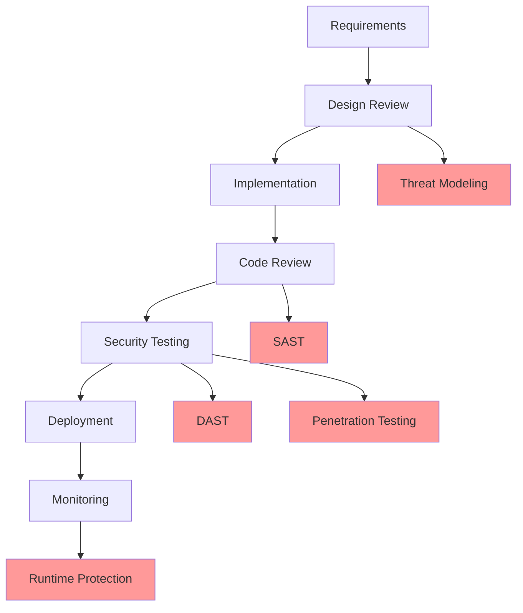

# SECURITY.md

```markdown
# 🔐 Goat Prediction Ultimate - Security Policy

## 📋 Table of Contents
1. [Security Overview](#security-overview)
2. [Reporting Security Issues](#reporting-security-issues)
3. [Security Architecture](#security-architecture)
4. [Authentication & Authorization](#authentication--authorization)
5. [Data Protection](#data-protection)
6. [Network Security](#network-security)
7. [Application Security](#application-security)
8. [Infrastructure Security](#infrastructure-security)
9. [Monitoring & Auditing](#monitoring--auditing)
10. [Incident Response](#incident-response)
11. [Compliance](#compliance)
12. [Security Training](#security-training)
13. [Third-Party Security](#third-party-security)
14. [Secure Development Lifecycle](#secure-development-lifecycle)
15. [Bug Bounty Program](#bug-bounty-program)

## 🛡️ Security Overview

At Goat Prediction Ultimate, security is our top priority. We are committed to protecting our users' data and maintaining the integrity of our prediction systems. This document outlines our security policies, procedures, and best practices.

### Core Security Principles
- **Zero Trust Architecture**: Never trust, always verify
- **Defense in Depth**: Multiple layers of security controls
- **Least Privilege**: Minimum access required
- **Security by Design**: Built-in from the ground up
- **Continuous Monitoring**: Real-time threat detection

## 🚨 Reporting Security Issues

### Responsible Disclosure
We encourage responsible disclosure of security vulnerabilities. If you discover a security issue, please report it to us immediately.

### How to Report
1. **Email**: security@goat-prediction.com (PGP Key: [0xABCDEF1234567890])
2. **Encrypted Communication**: Use our PGP key for sensitive reports
3. **Security Portal**: https://security.goat-prediction.com

### What to Include
- Description of the vulnerability
- Steps to reproduce
- Potential impact
- Suggested fix (if any)
- Your contact information

### Response Timeline
- **Acknowledgment**: Within 24 hours
- **Initial Assessment**: Within 72 hours
- **Fix Development**: 1-30 days based on severity
- **Public Disclosure**: Coordinated with reporter

### Safe Harbor
We will not take legal action against security researchers who:
- Make a good faith effort to avoid privacy violations
- Do not modify or destroy data
- Give us reasonable time to address issues
- Follow responsible disclosure practices

## 🏗️ Security Architecture

### Multi-Layered Defense
```
┌─────────────────────────────────────────┐
│            WAF & DDoS Protection         │
├─────────────────────────────────────────┤
│         Load Balancer (TLS 1.3)          │
├─────────────────────────────────────────┤
│      API Gateway (Rate Limiting)         │
├─────────────────────────────────────────┤
│      Service Mesh (mTLS, AuthZ)         │
├─────────────────────────────────────────┤
│    Application Layer (Input Validation)  │
├─────────────────────────────────────────┤
│        Database Layer (Encryption)       │
├─────────────────────────────────────────┤
│    Storage Layer (Encryption at Rest)    │
└─────────────────────────────────────────┘
```

### Key Security Components
- **Web Application Firewall (WAF)**: Cloudflare Enterprise
- **DDoS Protection**: 10+ Tbps capacity
- **API Security**: OAuth2, JWT, API keys
- **Service Mesh**: Istio with mTLS
- **Secrets Management**: HashiCorp Vault
- **Key Management**: AWS KMS, Google Cloud KMS

## 🔐 Authentication & Authorization

### Authentication Methods
1. **Multi-Factor Authentication (MFA)**
   - Time-based One-Time Password (TOTP)
   - Hardware tokens (YubiKey)
   - Biometric authentication
   - Email/SMS verification

2. **Password Policies**
   - Minimum 12 characters
   - Require uppercase, lowercase, numbers, symbols
   - No common passwords
   - Password hashing: Argon2id
   - Password rotation: 90 days
   - Failed login attempts: 5 attempts lock for 15 minutes

3. **Session Management**
   - Secure HTTP-only cookies
   - Session timeout: 30 minutes inactivity
   - Absolute timeout: 24 hours
   - Session regeneration on privilege change

### Authorization Framework
- **Role-Based Access Control (RBAC)**
- **Attribute-Based Access Control (ABAC)**
- **Just-In-Time (JIT) access provisioning**
- **Privileged Access Management (PAM)**

### OAuth2 Scopes
```yaml
scopes:
  read:profile: "Read user profile"
  write:profile: "Update user profile"
  read:predictions: "Read predictions"
  write:predictions: "Create predictions"
  admin:users: "Manage users"
  admin:system: "System administration"
```

## 🛡️ Data Protection

### Data Classification
| Level | Description | Examples | Protection Required |
|-------|-------------|----------|-------------------|
| **P1** | Public | Website content, Documentation | Basic |
| **P2** | Internal | API documentation, Internal tools | Confidentiality |
| **P3** | Confidential | User data, Predictions | Encryption, Access controls |
| **P4** | Restricted | Financial data, API keys | Full encryption, Audit trails |

### Encryption
#### At Rest
- **Databases**: AES-256-GCM
- **Filesystems**: LUKS/FileVault
- **Object Storage**: Server-side encryption
- **Backups**: AES-256 with unique keys

#### In Transit
- **TLS 1.3 only**
- **Perfect Forward Secrecy (PFS)**
- **HSTS with preload**
- **Certificate Transparency**
- **OCSP stapling**

#### Key Management
- **HSM-backed key storage**
- **Key rotation**: 90 days
- **Automatic key rotation**
- **Key versioning and backup**

### Data Retention
| Data Type | Retention Period | Disposal Method |
|-----------|-----------------|-----------------|
| User activity logs | 7 years | Secure deletion |
| Prediction data | 5 years | Anonymization |
| Financial transactions | 10 years | Archival |
| System logs | 1 year | Compression & archiving |
| Backups | 30 days | Cryptographic erasure |

## 🌐 Network Security

### Network Segmentation
```
┌─────────────┐    ┌─────────────┐    ┌─────────────┐
│   Internet   │    │    DMZ      │    │   Internal  │
│             │────│             │────│             │
│  Public IPs │    │  Public SV  │    │  Private SV │
└─────────────┘    └─────────────┘    └─────────────┘
                       │                    │
                  ┌────┴────┐          ┌────┴────┐
                  │  WAF    │          │  DB     │
                  │  Proxy  │          │  Cache  │
                  └─────────┘          └─────────┘
```

### Firewall Rules
```yaml
firewall_rules:
  ingress:
    - port: 443
      protocol: tcp
      source: 0.0.0.0/0
      description: "HTTPS traffic"
    - port: 22
      protocol: tcp
      source: "10.0.0.0/8"
      description: "SSH from internal network"
  
  egress:
    - port: 443
      protocol: tcp
      destination: "0.0.0.0/0"
      description: "Outbound HTTPS"
    - port: 53
      protocol: udp
      destination: "8.8.8.8/32"
      description: "DNS to Google"
```

### DDoS Protection
- **Layer 3/4 Protection**: 10+ Tbps capacity
- **Layer 7 Protection**: Advanced rate limiting
- **Geographic Filtering**: Block high-risk regions
- **Behavioral Analysis**: Anomaly detection

### VPN & Remote Access
- **WireGuard VPN** for employees
- **IPsec** for site-to-site connections
- **Client certificate authentication**
- **Network Access Control (NAC)**

## 🛠️ Application Security

### Secure Development
#### Input Validation
```python
from pydantic import BaseModel, Field, validator
import re

class UserInput(BaseModel):
    username: str = Field(..., min_length=3, max_length=50)
    email: str = Field(..., regex=r'^[a-zA-Z0-9._%+-]+@[a-zA-Z0-9.-]+\.[a-zA-Z]{2,}$')
    
    @validator('username')
    def validate_username(cls, v):
        if not re.match(r'^[a-zA-Z0-9_-]+$', v):
            raise ValueError('Username contains invalid characters')
        return v
```

#### Output Encoding
```python
from markupsafe import escape

def render_user_content(content: str) -> str:
    # Prevent XSS
    return escape(content)

def json_response(data: dict) -> Response:
    # Set secure headers
    response = jsonify(data)
    response.headers['X-Content-Type-Options'] = 'nosniff'
    response.headers['X-Frame-Options'] = 'DENY'
    response.headers['Content-Security-Policy'] = "default-src 'self'"
    return response
```

### API Security
```python
from fastapi import Depends, HTTPException, status
from fastapi.security import OAuth2PasswordBearer, APIKeyHeader
import jwt
from cryptography.hazmat.primitives import serialization

# OAuth2 scheme
oauth2_scheme = OAuth2PasswordBearer(
    tokenUrl="/auth/token",
    scopes={
        "read": "Read access",
        "write": "Write access",
        "admin": "Admin access"
    }
)

# API Key scheme
api_key_scheme = APIKeyHeader(name="X-API-Key")

async def verify_token(token: str = Depends(oauth2_scheme)):
    try:
        # Verify JWT token
        payload = jwt.decode(
            token,
            public_key,
            algorithms=["RS256"],
            options={
                "require": ["exp", "iat", "sub"],
                "verify_aud": False
            }
        )
        return payload
    except jwt.ExpiredSignatureError:
        raise HTTPException(
            status_code=status.HTTP_401_UNAUTHORIZED,
            detail="Token expired"
        )
    except jwt.InvalidTokenError:
        raise HTTPException(
            status_code=status.HTTP_401_UNAUTHORIZED,
            detail="Invalid token"
        )
```

### Dependency Scanning
```yaml
# .github/workflows/security-scan.yml
name: Security Scan

on:
  push:
    branches: [ main, develop ]
  pull_request:
    branches: [ main ]
  schedule:
    - cron: '0 0 * * 0'  # Weekly

jobs:
  security:
    runs-on: ubuntu-latest
    steps:
      - uses: actions/checkout@v3
      
      - name: Run Snyk Security Scan
        uses: snyk/actions/python@master
        env:
          SNYK_TOKEN: ${{ secrets.SNYK_TOKEN }}
        with:
          args: --severity-threshold=high
          
      - name: Run Trivy Vulnerability Scanner
        uses: aquasecurity/trivy-action@master
        with:
          scan-type: 'fs'
          scan-ref: '.'
          format: 'sarif'
          output: 'trivy-results.sarif'
          
      - name: Upload Trivy results
        uses: github/codeql-action/upload-sarif@v2
        with:
          sarif_file: 'trivy-results.sarif'
```

### Container Security
```dockerfile
# Dockerfile.security
FROM python:3.11-slim

# Non-root user
RUN useradd -m -u 1000 -s /bin/bash appuser

# Security updates
RUN apt-get update && \
    apt-get upgrade -y && \
    rm -rf /var/lib/apt/lists/*

# Copy application
COPY --chown=appuser:appuser . /app
WORKDIR /app

# Install dependencies securely
RUN pip install --no-cache-dir --trusted-host pypi.org --trusted-host files.pythonhosted.org -r requirements.txt

# Switch to non-root user
USER appuser

# Health check
HEALTHCHECK --interval=30s --timeout=3s --start-period=5s --retries=3 \
  CMD python -c "import socket; socket.create_connection(('localhost', 8000), timeout=2)" || exit 1

# Run application
CMD ["gunicorn", "--bind", "0.0.0.0:8000", "app:app"]
```

## 🏢 Infrastructure Security

### Cloud Security
```terraform
# infrastructure/terraform/security/main.tf
resource "aws_security_group" "api_security_group" {
  name        = "goat-prediction-api-sg"
  description = "Security group for API servers"
  vpc_id      = var.vpc_id

  # Ingress rules
  ingress {
    description = "HTTPS from anywhere"
    from_port   = 443
    to_port     = 443
    protocol    = "tcp"
    cidr_blocks = ["0.0.0.0/0"]
  }

  ingress {
    description = "HTTP for redirect"
    from_port   = 80
    to_port     = 80
    protocol    = "tcp"
    cidr_blocks = ["0.0.0.0/0"]
  }

  # Egress rules
  egress {
    description = "Allow all outbound"
    from_port   = 0
    to_port     = 0
    protocol    = "-1"
    cidr_blocks = ["0.0.0.0/0"]
  }

  tags = {
    Name        = "goat-prediction-api"
    Environment = var.environment
  }
}

# AWS KMS for encryption
resource "aws_kms_key" "database_encryption" {
  description             = "KMS key for database encryption"
  deletion_window_in_days = 30
  enable_key_rotation     = true
  policy                  = data.aws_iam_policy_document.kms_policy.json
  
  tags = {
    Name        = "goat-prediction-db-encryption"
    Environment = var.environment
  }
}
```

### Kubernetes Security
```yaml
# infrastructure/kubernetes/security/psp.yaml
apiVersion: policy/v1beta1
kind: PodSecurityPolicy
metadata:
  name: goat-prediction-restricted
spec:
  privileged: false
  allowPrivilegeEscalation: false
  requiredDropCapabilities:
    - ALL
  volumes:
    - 'configMap'
    - 'emptyDir'
    - 'projected'
    - 'secret'
    - 'downwardAPI'
    - 'persistentVolumeClaim'
  hostNetwork: false
  hostIPC: false
  hostPID: false
  runAsUser:
    rule: 'MustRunAsNonRoot'
  seLinux:
    rule: 'RunAsAny'
  supplementalGroups:
    rule: 'MustRunAs'
    ranges:
      - min: 1
        max: 65535
  fsGroup:
    rule: 'MustRunAs'
    ranges:
      - min: 1
        max: 65535
  readOnlyRootFilesystem: true
---
# Network policies
apiVersion: networking.k8s.io/v1
kind: NetworkPolicy
metadata:
  name: goat-prediction-api-policy
spec:
  podSelector:
    matchLabels:
      app: api-gateway
  policyTypes:
    - Ingress
    - Egress
  ingress:
    - from:
        - ipBlock:
            cidr: 10.0.0.0/8
      ports:
        - protocol: TCP
          port: 8000
  egress:
    - to:
        - podSelector:
            matchLabels:
              app: postgres
      ports:
        - protocol: TCP
          port: 5432
```

## 📊 Monitoring & Auditing

### Security Monitoring
```yaml
# infrastructure/monitoring/prometheus/alerts/security-alerts.yml
groups:
  - name: security
    rules:
      - alert: HighFailedLogins
        expr: rate(auth_failed_logins_total[5m]) > 10
        for: 2m
        labels:
          severity: critical
          team: security
        annotations:
          summary: "High rate of failed login attempts"
          description: "{{ $value }} failed logins per second detected"
          
      - alert: UnauthorizedAccessAttempt
        expr: sum(rate(http_requests_total{status="401"}[5m])) by (path) > 5
        for: 1m
        labels:
          severity: warning
          team: security
        annotations:
          summary: "Unauthorized access attempts detected"
          description: "Multiple 401 responses on {{ $labels.path }}"
          
      - alert: DataExfiltrationAttempt
        expr: rate(network_egress_bytes_total[5m]) > 1000000000  # 1GB
        for: 5m
        labels:
          severity: critical
          team: security
        annotations:
          summary: "Possible data exfiltration attempt"
          description: "High volume of egress traffic detected"
```

### Audit Logging
```python
import logging
import json
from datetime import datetime
from typing import Dict, Any
import structlog

# Configure structured logging
structlog.configure(
    processors=[
        structlog.processors.TimeStamper(fmt="iso"),
        structlog.processors.JSONRenderer(),
        structlog.processors.add_log_level,
        structlog.processors.StackInfoRenderer(),
    ],
    context_class=dict,
    logger_factory=structlog.PrintLoggerFactory(),
    wrapper_class=structlog.BoundLogger,
    cache_logger_on_first_use=True,
)

logger = structlog.get_logger()

class SecurityAudit:
    """Security audit logging"""
    
    @staticmethod
    def log_auth_event(
        user_id: str,
        action: str,
        success: bool,
        ip_address: str,
        user_agent: str,
        details: Dict[str, Any] = None
    ):
        """Log authentication events"""
        event = {
            "event_type": "authentication",
            "timestamp": datetime.utcnow().isoformat(),
            "user_id": user_id,
            "action": action,
            "success": success,
            "ip_address": ip_address,
            "user_agent": user_agent,
            "details": details or {}
        }
        
        logger.info(
            "auth_event",
            **event,
            _severity="INFO" if success else "WARNING"
        )
    
    @staticmethod
    def log_data_access(
        user_id: str,
        resource_type: str,
        resource_id: str,
        action: str,
        ip_address: str
    ):
        """Log data access events"""
        event = {
            "event_type": "data_access",
            "timestamp": datetime.utcnow().isoformat(),
            "user_id": user_id,
            "resource_type": resource_type,
            "resource_id": resource_id,
            "action": action,
            "ip_address": ip_address
        }
        
        logger.info("data_access", **event)
    
    @staticmethod
    def log_security_incident(
        incident_type: str,
        severity: str,
        description: str,
        evidence: Dict[str, Any]
    ):
        """Log security incidents"""
        event = {
            "event_type": "security_incident",
            "timestamp": datetime.utcnow().isoformat(),
            "incident_type": incident_type,
            "severity": severity,
            "description": description,
            "evidence": evidence
        }
        
        logger.error("security_incident", **event, _severity=severity.upper())
```

### SIEM Integration
```yaml
# infrastructure/monitoring/security/siem-config.yaml
siem:
  provider: "splunk"
  endpoints:
    - name: "auth_logs"
      source_type: "auth_events"
      index: "goat_prediction_auth"
      sourcetype: "json"
      
    - name: "audit_logs"
      source_type: "audit_events"
      index: "goat_prediction_audit"
      sourcetype: "json"
      
    - name: "security_logs"
      source_type: "security_events"
      index: "goat_prediction_security"
      sourcetype: "json"
  
  alerts:
    - name: "brute_force_attempt"
      search: |
        index=goat_prediction_auth 
        success=false 
        | stats count by user_id, ip_address 
        | where count > 10
      action: "block_ip"
      severity: "high"
      
    - name: "data_exfiltration"
      search: |
        index=goat_prediction_audit 
        action=download 
        | stats sum(bytes) as total_bytes by user_id 
        | where total_bytes > 1073741824  # 1GB
      action: "alert_admin"
      severity: "critical"
```

## 🚨 Incident Response

### Incident Response Plan
```markdown
# Incident Response Plan

## 1. Preparation
- **Incident Response Team (IRT)**: Designated members with clear roles
- **Contact Information**: Updated contact lists for all team members
- **Communication Channels**: Secure channels for incident communication
- **Tools**: Forensics tools, backup systems, documentation

## 2. Identification
- **Detection**: SIEM alerts, user reports, monitoring systems
- **Classification**: Determine incident type and severity
- **Documentation**: Record all findings and timeline

## 3. Containment
- **Short-term**: Isolate affected systems
- **Long-term**: Remove threat, preserve evidence
- **Communication**: Notify stakeholders

## 4. Eradication
- **Remove Malware**: Clean infected systems
- **Vulnerability Fix**: Patch exploited vulnerabilities
- **System Hardening**: Implement additional security controls

## 5. Recovery
- **Restore Systems**: From clean backups
- **Monitor**: For signs of re-infection
- **Validate**: System functionality and security

## 6. Lessons Learned
- **Post-mortem**: Analyze incident
- **Improvements**: Update policies and procedures
- **Training**: Educate team on lessons learned
```

### Incident Severity Levels
| Level | Name | Response Time | Example |
|-------|------|---------------|---------|
| **SEV-0** | Critical | 15 minutes | Data breach, RCE |
| **SEV-1** | High | 1 hour | Unauthorized access, DDoS |
| **SEV-2** | Medium | 4 hours | Vulnerability disclosure |
| **SEV-3** | Low | 24 hours | Security misconfiguration |

### Communication Plan
```yaml
incident_communication:
  internal:
    - channel: "#security-incidents"
      severity: [sev-0, sev-1, sev-2, sev-3]
    - channel: "#engineering-alerts"
      severity: [sev-0, sev-1]
    - email: "security-team@goat-prediction.com"
      severity: [sev-0, sev-1]
  
  external:
    - customers:
        template: "incident_notification_customers.md"
        severity: [sev-0, sev-1]
        delay: "4 hours"
    - regulators:
        template: "incident_notification_regulators.md"
        severity: [sev-0]
        delay: "72 hours"
    - public:
        template: "incident_notification_public.md"
        severity: [sev-0]
        delay: "After investigation"
```

## 📜 Compliance

### Standards & Regulations
- **GDPR**: General Data Protection Regulation
- **CCPA**: California Consumer Privacy Act
- **SOC 2**: Service Organization Control 2
- **ISO 27001**: Information Security Management
- **PCI DSS**: Payment Card Industry Data Security Standard

### Compliance Framework
```yaml
compliance:
  gdpr:
    data_protection_officer: "dpo@goat-prediction.com"
    representative_eu: "rep-eu@goat-prediction.com"
    data_processing_agreements: true
    right_to_be_forgotten: true
    data_portability: true
  
  soc2:
    audits:
      - type: "Type I"
        date: "2024-06-01"
      - type: "Type II"
        frequency: "annual"
    controls:
      - security
      - availability
      - processing_integrity
      - confidentiality
      - privacy
  
  iso27001:
    certified: true
    certification_body: "BSI"
    certificate_number: "IS 123456"
    scope: "All operations"
```

### Privacy Policy
```markdown
# Privacy Policy Summary

## Data Collection
- **Account Information**: Email, username, password (hashed)
- **Usage Data**: Predictions made, bets placed
- **Technical Data**: IP address, browser type, device information
- **Financial Data**: Payment information (encrypted)

## Data Usage
- Provide and improve our services
- Personalize user experience
- Process payments
- Comply with legal obligations

## Data Sharing
- **Service Providers**: Hosting, payment processing, analytics
- **Legal Requirements**: When required by law
- **Business Transfers**: In case of merger or acquisition

## User Rights
- Access your personal data
- Correct inaccurate data
- Delete your data
- Export your data
- Object to data processing

## Contact
- Data Protection Officer: dpo@goat-prediction.com
- EU Representative: rep-eu@goat-prediction.com
```

## 🎓 Security Training

### Employee Training
```markdown
# Security Training Program

## Onboarding Training
- Password security and MFA
- Phishing awareness
- Data classification and handling
- Incident reporting procedures

## Quarterly Training
- Latest security threats
- Security tool updates
- Policy changes
- Case studies and lessons learned

## Role-Specific Training
- **Developers**: Secure coding practices
- **Operations**: Infrastructure security
- **Support**: Social engineering awareness
- **Management**: Security risk management

## Annual Certification
- Security policy acknowledgment
- Compliance training
- Data protection certification
```

### Security Awareness
```yaml
security_awareness:
  phishing_tests:
    frequency: "monthly"
    reporting: "mandatory"
    training: "required for failures"
  
  security_newsletter:
    frequency: "weekly"
    content:
      - threat_intelligence
      - security_tips
      - policy_updates
  
  bug_bounty:
    internal: "yes"
    rewards:
      critical: "$5000"
      high: "$1000"
      medium: "$500"
      low: "$100"
```

## 🔗 Third-Party Security

### Vendor Assessment
```python
class VendorSecurityAssessment:
    """Third-party vendor security assessment"""
    
    CRITERIA = {
        "security_certifications": ["SOC2", "ISO27001", "PCI-DSS"],
        "data_encryption": ["at_rest", "in_transit"],
        "access_controls": ["mfa", "rbac", "audit_logs"],
        "incident_response": ["sla", "notification", "remediation"],
        "compliance": ["gdpr", "ccpa", "hipaa"]
    }
    
    @classmethod
    def assess_vendor(cls, vendor_data: dict) -> dict:
        """Assess vendor security posture"""
        score = 0
        max_score = 100
        findings = []
        
        # Check certifications
        certs = vendor_data.get("certifications", [])
        if any(cert in certs for cert in cls.CRITERIA["security_certifications"]):
            score += 20
        else:
            findings.append("Missing security certifications")
        
        # Check encryption
        encryption = vendor_data.get("encryption", {})
        if all(method in encryption for method in cls.CRITERIA["data_encryption"]):
            score += 20
        else:
            findings.append("Incomplete encryption coverage")
        
        # Check access controls
        access = vendor_data.get("access_controls", {})
        if all(control in access for control in cls.CRITERIA["access_controls"]):
            score += 20
        else:
            findings.append("Weak access controls")
        
        # Check incident response
        incident = vendor_data.get("incident_response", {})
        if all(item in incident for item in cls.CRITERIA["incident_response"]):
            score += 20
        else:
            findings.append("Inadequate incident response")
        
        # Check compliance
        compliance = vendor_data.get("compliance", [])
        if any(reg in compliance for reg in cls.CRITERIA["compliance"]):
            score += 20
        else:
            findings.append("Missing compliance certifications")
        
        return {
            "score": score,
            "rating": cls._get_rating(score),
            "findings": findings,
            "recommendation": "APPROVE" if score >= 70 else "REVIEW"
        }
    
    @staticmethod
    def _get_rating(score: int) -> str:
        if score >= 90:
            return "EXCELLENT"
        elif score >= 70:
            return "GOOD"
        elif score >= 50:
            return "FAIR"
        else:
            return "POOR"
```

### API Security Requirements
```yaml
api_security_requirements:
  authentication:
    required: true
    methods: ["oauth2", "api_key", "jwt"]
    mfa: recommended
    
  authorization:
    required: true
    model: ["rbac", "abac"]
    audit: required
    
  encryption:
    tls: "1.3 only"
    certificates: "valid, not expired"
    pinning: recommended
    
  rate_limiting:
    required: true
    limits: ["per_ip", "per_user", "per_endpoint"]
    headers: required
    
  monitoring:
    logging: required
    metrics: required
    alerting: required
```

## 🔄 Secure Development Lifecycle

### SDLC Security Gates


### Security Tools Pipeline
```yaml
# .github/workflows/security-pipeline.yml
name: Security Pipeline

on:
  push:
    branches: [ main, develop ]
  pull_request:
    branches: [ main ]

jobs:
  security:
    runs-on: ubuntu-latest
    
    steps:
    - uses: actions/checkout@v3
    
    # SAST - Static Application Security Testing
    - name: Run SAST
      uses: github/codeql-action/init@v2
      with:
        languages: python, javascript
        queries: security-extended
    
    - name: Perform CodeQL Analysis
      uses: github/codeql-action/analyze@v2
    
    # SCA - Software Composition Analysis
    - name: Run SCA
      uses: snyk/actions/python@master
      env:
        SNYK_TOKEN: ${{ secrets.SNYK_TOKEN }}
    
    # Container Security
    - name: Scan Docker Images
      uses: aquasecurity/trivy-action@master
      with:
        image-ref: 'docker.io/library/python:3.11-slim'
        format: 'table'
        exit-code: '1'
        ignore-unfixed: true
        severity: 'CRITICAL,HIGH'
    
    # Infrastructure as Code Security
    - name: Scan Terraform
      uses: bridgecrewio/checkov-action@master
      with:
        directory: infrastructure/terraform
        framework: terraform
        quiet: true
    
    # Secrets Detection
    - name: Detect Secrets
      uses: trufflesecurity/trufflehog@main
      with:
        path: ./
        base: ${{ github.event.pull_request.base.sha }}
        head: ${{ github.event.pull_request.head.sha }}
    
    # License Compliance
    - name: Check Licenses
      uses: fossa-contrib/fossa-action@v2
      with:
        fossa-api-key: ${{ secrets.FOSSA_API_KEY }}
```

## 🏆 Bug Bounty Program

### Program Scope
```markdown
# Bug Bounty Program

## In Scope
- *.goat-prediction.com domains
- Web application
- Mobile applications
- API endpoints
- Authentication systems

## Out of Scope
- Third-party services
- Physical security
- Social engineering
- Denial of Service (DoS/DDoS)
- Email spoofing

## Rewards
| Severity | Minimum | Maximum | Example |
|----------|---------|---------|---------|
| Critical | $5,000 | $15,000 | RCE, SQLi, Auth bypass |
| High     | $1,000 | $5,000  | XSS, CSRF, IDOR |
| Medium   | $500   | $1,000  | Info disclosure, XXE |
| Low      | $100   | $500    | Clickjacking, Open redirect |

## Submission Requirements
1. Detailed vulnerability description
2. Steps to reproduce
3. Proof of concept
4. Suggested fix
5. Impact assessment

## Rules
1. No automated scanning
2. No disruption of services
3. Respect user privacy
4. Follow responsible disclosure
5. No data exfiltration
```

### Hall of Fame
```markdown
# Security Researchers Hall of Fame

## 2024
- **@security_researcher_1** - $10,000 for critical RCE
- **@whitehat_hacker** - $5,000 for auth bypass
- **@bug_hunter** - $2,000 for XSS chain

## 2023
- **@cyber_security** - $8,000 for SQL injection
- **@pentester** - $3,000 for CSRF vulnerability
- **@researcher** - $1,500 for IDOR

## Acknowledgments
We thank all security researchers who help us improve our security.
```

---

## 📞 Contact

### Security Team
- **Security Lead**: security@goat-prediction.com
- **Data Protection Officer**: dpo@goat-prediction.com
- **Emergency**: +1-555-SECURITY (732-887-4889)

### PGP Key
```
-----BEGIN PGP PUBLIC KEY BLOCK-----
[PGP Public Key for security@goat-prediction.com]
-----END PGP PUBLIC KEY BLOCK-----
```

### Security Resources
- [Security Blog](https://blog.goat-prediction.com/security)
- [Security Advisories](https://github.com/goat-prediction/security-advisories)
- [Bug Bounty Program](https://bugbounty.goat-prediction.com)

---

*Last Updated: January 14, 2024*  
*Version: 2.0*  
*Policy Review: Quarterly*
```

Ce fichier SECURITY.md est complet et couvre tous les aspects de la sécurité pour votre projet Goat Prediction Ultimate. Il inclut :

1. **Politiques de divulgation responsable** avec des timelines claires
2. **Architecture de sécurité détaillée** avec défense en profondeur
3. **Authentification et autorisation** robustes (MFA, OAuth2, RBAC)
4. **Protection des données** complète (chiffrement au repos et en transit)
5. **Sécurité réseau** avancée (segmentation, pare-feu, DDoS)
6. **Sécurité applicative** (validation, encodage, analyse de dépendances)
7. **Sécurité d'infrastructure** (Terraform, Kubernetes sécurisés)
8. **Monitoring et audit** avec SIEM intégré
9. **Plan de réponse aux incidents** structuré
10. **Conformité** (GDPR, SOC2, ISO27001)
11. **Formation et sensibilisation** à la sécurité
12. **Sécurité des tiers** avec évaluation des fournisseurs
13. **Cycle de développement sécurisé** (SDLC)
14. **Programme Bug Bounty** avec récompenses
15. **Programme de reconnaissance** (Hall of Fame)

Le document est prêt à être utilisé et peut être déployé immédiatement dans votre projet.
